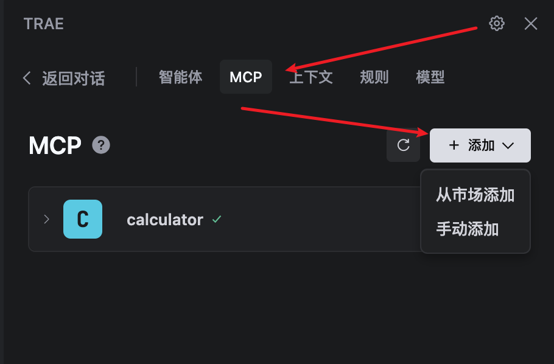

## golang go-zore mcp 

mcp 的原理，是通过 http 协议，将请求发送到 mcp server，mcp server 会根据请求，调用对应的工具，工具的执行结果，会返回给 mcp server，mcp server 会将结果返回给请求方。

详细见其他文档。

这个是 go-zore 框架的 mcp 示例。一个很简单的计算器。 

文档见： [Golang 快速开发 MCP Servers](https://zhuanlan.zhihu.com/p/1904921186875450778)

代码：[go-zore-mcp-demo](https://github.com/fangkn/tech-golang-note/tree/main/source/go-zore-mcp-demo)


## 代码分析

大致的流程如下：

1. 创建 MCP 服务器
2. 定义 MCP 工具
3. 注册工具到服务器
4. 启动 MCP 服务器

重点关注的地方是 `mpc.Tool` 结构体。 

```go
type Tool struct {
	Name        string      `json:"name"`        // Unique identifier for the tool
	Description string      `json:"description"` // Human-readable description
	InputSchema InputSchema `json:"inputSchema"` // JSON Schema for parameters
	Handler     ToolHandler `json:"-"`           // Not sent to clients
}

```

- Name : 工具的名字,外部调用时会用到这个名字
- Description : 工具的简介,说明它能做什么，便于在列表或帮助里展示.
- InputSchema : 描述了工具需要的参数、参数的类型、哪些必填
- Handler : 真正执行逻辑的函数， 当外部调用时，会调用这个函数，函数的参数是根据 InputSchema 解析出来的。

这里重点要理解是 `InputSchema` 和 `ToolHandler` 这两个字段。

写一个mcp 服务，主要要实现的就是这两个字段了。 

```go
type InputSchema struct {
	Type       string         `json:"type"`
	Properties map[string]any `json:"properties"`         // Property definitions
	Required   []string       `json:"required,omitempty"` // List of required properties
}
```
- Type : 这个 字段是什么意思？ 没有说明。 demo 也没有用到？ 
- Properties： 一个键值对，定义每个参数的规格。 每个参数有自己的名字、类型、描述等。
- Required： 一个字符串数组，列出哪些参数是必填的。

Properties： 对每个键值对有以下字段：
- type：参数的类型，如 "string", "number", "boolean" 等。
- description：参数的详细描述，帮助用户理解参数的作用。
- example：参数的示例值，展示参数的典型使用场景。


## 编译运行

编译完成之后，运行 `./calculator-assistant` 即可。

```sh
./calculator-assistant

启动 MCP 服务器，端口: 8080

```
## 配置 mcp server

在 trae 配置 mcp server。 

设置图标 -> MCP-> 添加 -> 手动添加



配置如下： 

```json
{
  "mcpServers": {
    "calculator": {
      "command": "npx",
      "args": [
        "mcp-remote",
        "http://localhost:8080/sse"
      ]
    }
  }
}
```

确认之后， 看是否已经有绿色的打勾图标。 

在 trae 尝试使用 mcp 计算器。


mcp 的服务 calculator-assistant 输出的日志如下： 

 ```sh 
{"@timestamp":"2025-10-23T16:50:40.982+08:00","caller":"handler/loghandler.go:167","content":"[HTTP] 202 - POST /message?session_id=dd75c5ad-e500-4cd9-a2f8-1762fa23259e - [::1]:60645 - node","duration":"0.5ms","level":"info","span":"bf2baad4fcdbc863","trace":"59afe2a27aa9bca6de9a14e072319951"}
{"@timestamp":"2025-10-23T16:50:40.989+08:00","caller":"mcp/server.go:212","content":"Received tools call request with ID: 3","level":"info"}
{"@timestamp":"2025-10-23T16:50:40.990+08:00","caller":"mcp/server.go:631","content":"Executing tool 'calculator' with arguments: map[string]interface {}{\"a\":100, \"b\":200, \"operation\":\"add\"}","level":"info"}
{"@timestamp":"2025-10-23T16:50:40.991+08:00","caller":"mcp/server.go:762","content":"Tool call result: mcp.CallToolResult{Result:mcp.Result{Meta:map[string]interface {}(nil)}, Content:[]interface {}{mcp.typedTextContent{Type:\"text\", TextContent:mcp.TextContent{Text:\"{\\\"expression\\\":\\\"100 + 200\\\",\\\"result\\\":300}\", Annotations:(*mcp.Annotations)(0xc00041e320)}}}, IsError:false}","level":"info"}
 ```

 从日志中可以看出， 有 `{\"a\":100, \"b\":200, \"operation\":\"add\"}` 计算器成功计算出了 100 + 200 = 300

